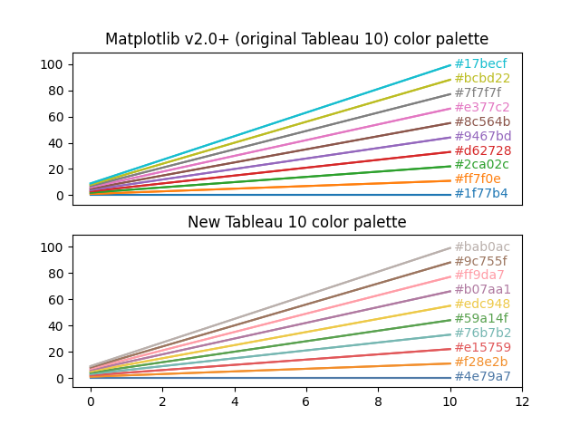

# Plot color palettes

*A comparison of Matplotlib and Tableau color palettes*

The Python plotting library Matplotlib uses what is called a [category10 color palette](https://matplotlib.org/stable/users/prev_whats_new/dflt_style_changes.html#colors-color-cycles-and-colormaps), also used by [Vega](https://vega.github.io/vega/) and [d3](https://d3js.org/). Surprisingly, this color palette is not friendly to those with certain types of color blindness!

I knew that category10 was inspired by the Tableau 10 color palette and I would have expected Tableau to select more accessible colors.

I did some research on Tableau 10 and found that [the palette was updated in 2016 to be more accessible](https://www.tableau.com/blog/colors-upgrade-tableau-10-56782). Awesome!

Here's a comparison of the Matplotlib default (equivalent to the original Tableau 10) and the new Tableau 10 color palettes:



To use the Tableau 10 new color palette, insert this bit of code at the beginning of your Python script:

```
plt.rcParams["axes.prop_cycle"] = cycler(
    "color",
    [
        "#4e79a7",
        "#f28e2b",
        "#e15759",
        "#76b7b2",
        "#59a14f",
        "#edc948",
        "#b07aa1",
        "#ff9da7",
        "#9c755f",
        "#bab0ac",
    ],
)
```

### Files

- **.gitignore**: GitHub Python git ignore file sourced [here](https://github.com/github/gitignore/blob/main/Python.gitignore)
- **LICENSE**: project license 
- **plot_color_palettes.py**: source Python file
- **requirements.txt**: Python required modules list
